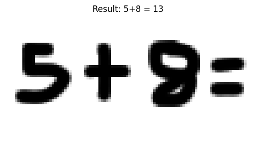

# Freehand Equation Solver
A PyTorch CNN recognizing handwritten digits (0-9) and operators (+, -) from Kaggle’s Handwritten Digits and Operators dataset, achieving 94% accuracy. Uses OpenCV to segment freehand equations (e.g., "5+8=") and solves them (e.g., "5+8=13"). Inspired by iPad Calculator Notes.

## Features
- CNN-based classification of digits and operators.
- OpenCV segmentation for freehand input.
- Solves basic arithmetic expressions.

## Results
- Input: "5+8=" → Output: "5+8=13"
- Note: Ongoing tuning for equations like "9-5=" to improve operator detection.

## Setup
- Dataset: [Kaggle Handwritten Digits and Operators](https://www.kaggle.com/datasets/michelheusser/handwritten-digits-and-operators)
- Run in Google Colab with the provided notebook.

## Demo

